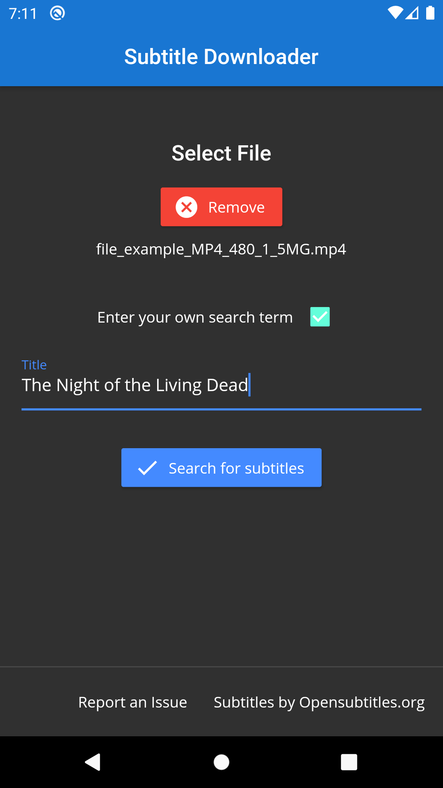
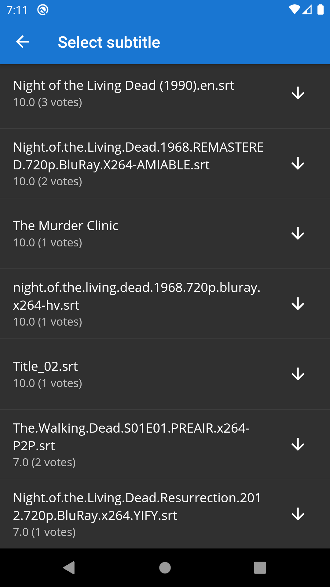
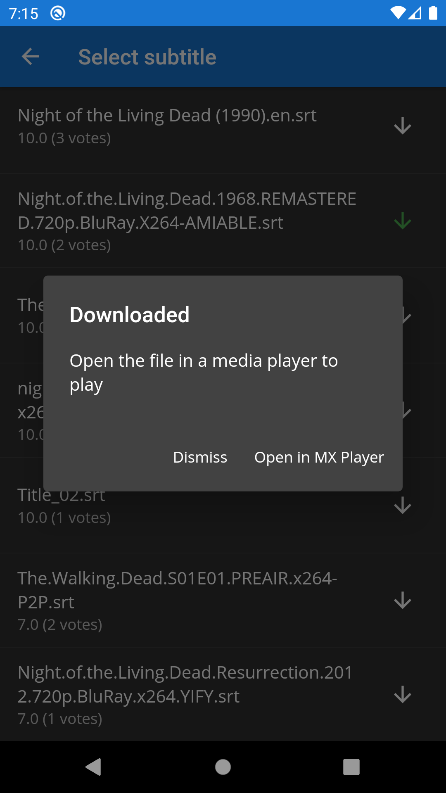

# subtitle-downloader
<p align="center">
  
  
  
</p>
A Flutter app to fetch subtitles from OpenSubtitles.org

## Usage
1. Go to project root and run
```
flutter pub get
```  
  
2. Request an 
[OpenSubtitles.org User Agent](https://trac.opensubtitles.org/projects/opensubtitles/wiki/DevReadFirst)  
  

3. Edit the details in `lib/constants.dart`  

4. [Build](https://flutter.dev/docs/deployment/android) the project

## Credits
[opensubtitles_hash](https://github.com/NBTX/opensubtitles_hash) by NBTX
